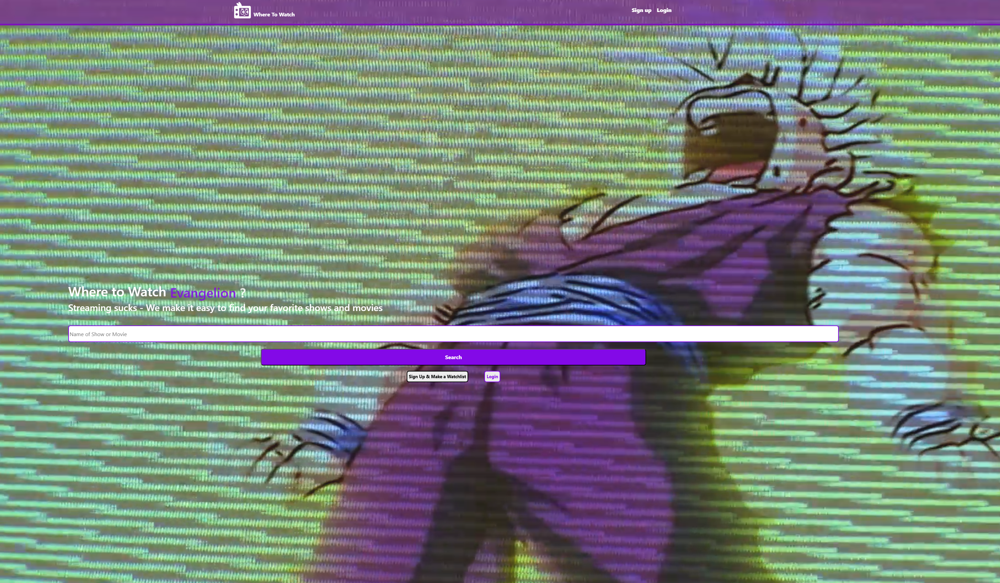
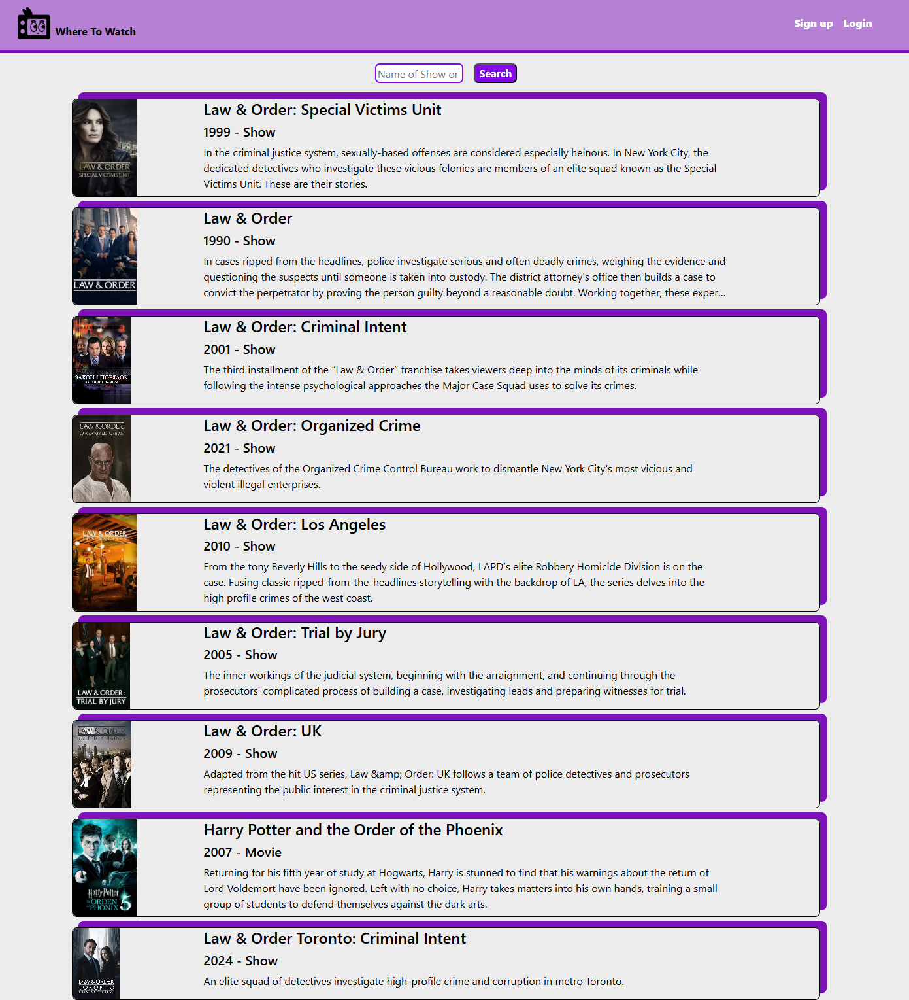
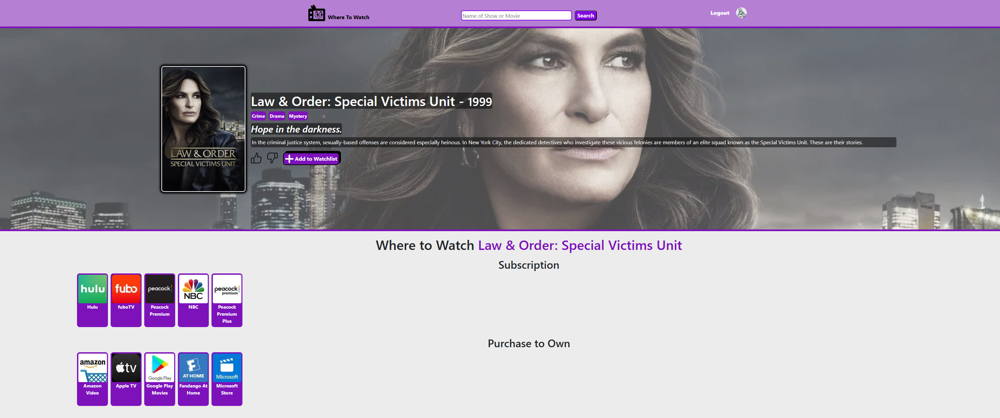
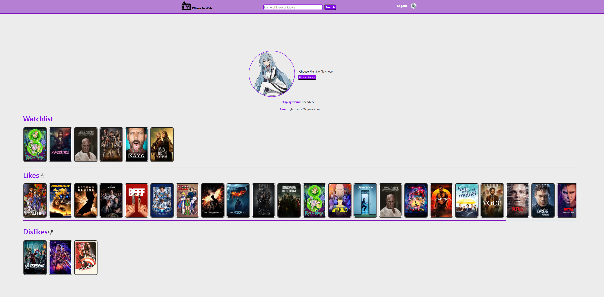

# Where To Watch
In the Age of Streaming, Where To Watch is a search engine that helps users find what streaming service their favorite shows and movies are on.

Users can save shows and movies to a watchlist and leave feedback for content via a like or dislike. Where To Watch is a CRUD app created via SQL and PostgreSQL using Docker and Oracle Cloud VM to host.

https://www.wheretowatch.today

## Streaming Sucks, Where To Watch, doesn't!

